#GymBunnies, Milestone Project 3

(Developer: Richard Messenger)

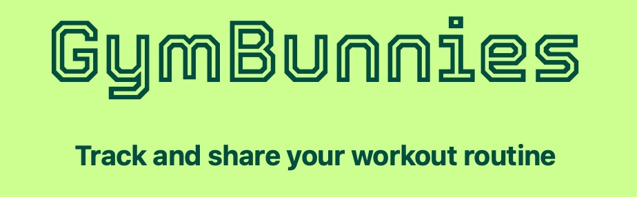

[Live webpage](https://gymbunnies-211fc7651ce9.herokuapp.com/login)

GymBunnies is a new social enterprise designed to enable gym goers to engage with a like-minded community through the sharing of their workout routines. In doing so, the service aims to encourage social engagement, and provide the user with motivation, alternative insight, and a tool to track the progress of their own fitness goals.

The website is designed to be accessible and uniform across all devices, allowing, ease of use and clear comunication of the relevant features.

## Contents

1. [Project Goals](#project-goals)
    1. [User Goals](#user-goals)
    2. [Site Owner Goals](#site-owner-goals)
    3. [Developer Goals](#developer-goals)
2. [User Experience](#user-experience)
    1. [Target Audience](#target-audience)
    2. [User Requirements and Expectations](#user-requirements-and-expectations)
    3. [User Stories](#user-stories)
3. [Design](#design)
    1. [Design Choices](#design-choices)
    2. [Colours](#colours)
    3. [Fonts](#fonts)
    4. [Structure](#structure)
    5. [Wireframes](#wireframes)
4. [Technologies Used](#technologies-used)
    1. [Languages](#languages)
    2. [Frameworks and Tools](#frameworks-and-tools)
5. [Features](#features)
6. [Testing](#testing)
    1. [HTML Validation](#HTML-validation)
    2. [CSS Validation](#CSS-validation)
    3. [Accessibility](#accessibility)
    4. [Performance](#performance)
    5. [Device testing](#performing-tests-on-various-devices)
    6. [Browser compatibility](#browser-compatibility)
8. [Bugs](#bugs)
9. [Deployment](#deployment)
10. [Credits](#credits)
11. [Acknowledgements](#acknowledgements)

## Project Goals

The key goal is to assist users in tracking their workout routines, be it recording their personal best time at the local park run to logging the variety and progress of muscle development or strength training. The site aim to allow users to achieve this in a simple and efficient manner utilising strong UX design and compatibility across multiple devices.

### User Goals

- To record their activity levels
- To meet people at the local health centre
- To view other workout routines
- To challenge themselves
- To make a healthy lifestyle part of their day-to-day routine

### Site Owner Goals

- Promote healthy living
- Provide a tool to engage the user and support them in taking the first step towards a healthier lifestyle
- Increase site traffic
- Provide comprehensive health information
- Design a site that will attract corporate partnerships
- Encourage uptake of the company's subscription services when available
- Have a representative present at health centers

### Developer Goals

- To create a uniform page layout across all devices
- To build a stable platform which can be developed to include other fitness features
- Provide a bug free UX
- To allow sub-sections to stack vertically on smaller devices
- Easy navigation
- Clear colour contrast for visually impaired users  
  
[Back to Contents](#Contents)  
  
## User Experience

### Target Audience

- Anyone with a newfound desire to maintain a healthy lifestyle
- Anyone with a desire to track their workout progress
- Users who are new to an area and want to meet likeminded individuals
- Anyone who wants to meet likeminded individuals

### User Requirements and Expectations

- Reliable, consistent navigation
- No dead links
- Clear presentation across all devices
- Accessibility
- Not text heavy
- An interest in healthy living

### User Stories

#### First Visit

- How do I add a workout
- What if I make a mistake adding the information
- Who else uses the site
- What other related information is there
- Do I need to register

#### Repeat visit

- What time was my last run
- I've forgotten my password
- How fast did my friend run
- I've switched gym clubs
- Has anyone requested to connect with me
- To plan their workouts in advance

#### Site Owner

- I want repeat visits
- I want to increase the website traffic
- I want to make our information readily available
- I want to build a community
- I want to encourage people to get healthy  
  
[Back to Contents](#Contents)  
  
## Design

### Design Choices

The website is designed to focus on its key features: the ability to add details of your recent workouts and the ability to engage with other users. A consistent layout has been chosen across the website. The main homepage is the user's profile page, where they are able to view their workouts, add to them, and update their personal information. The 'add workout' button is large and clearly identifiable, with the edit button intuitively located on the completed workouts. 

For ease of navigation, the top menu bar and footer section are consistent across all devices. Links are underlined to inform the user which page they are currently viewing. The top menu collapses into a side bar on small screen sizes.

Every top menu page follows a two-column approach:

The lefthand side contains information relating to the purpose of the corresponding page: the user's profile, the member list or connection requests.

The righthand side displays either the user's information or information on the user whose page they are viewing. In both cases, the layout is identical. What differentiates the right hand section is the options available to the user: adding, removing or receiveing information about a connection, or, if it is their profile, the option to edit it. Consistently on in this section is a link to view user connections.

On small screens the left hand side will automatically stack on top of the rright hand side.

The footer pages can be viewed by non-users and do not follow the two-column approach but are consistent in their style.

### Colours

When choosing colours, the focus is on accessibility. A number of combinations were tested using a [contrast checker](https://www.siegemedia.com/contrast-ratio) to make sure a score above 4.5 was achieved for text contrasts. Ideally, we aimed for 7.

A green colour scheme was chosen as it is gender neutral and evoques a sense of nature and healthy life.

All page text uses the same colour, #004d40, known as teal darken 4 on [Materialise.com](https://materializecss.com). The exception is on buttons, where colours that relate to the button's function have been used, and on flash alert messages to achieve greater impact on viewing.
 
- Page text: teal darken-4, #004d40
- Top menu background: light-green accent-3, #76ff03
- Left section background: light-blue lighten-5, #e1f5fe
- Left section, add workout: teal accent-2, #64ffda
- Left section, workout card: teal accent-2, #64ffda
- Left section, exercise card: teal accent-1, #a7ffeb
- Left section member card:  teal accent-1, #a7ffeb
- Right section background: teal accent-2, #64ffda
- Right secton, User Card: teal accent-1, #a7ffeb
- Right secton, Stats Card: light-green accent-3, #76ff03
- Footer main background: light-green accent-1, #ccff90
- Footer base: light-green accent-3, #76ff03
- Edit profile button: teal lighten-1, #26a69a
- Edit profile button text: white, #ffffff
- Connect button: light-green accent-3, #76ff03
- Connect button text: teal darken-4, #004d40
- Remove Button: red darken-4, #b71c1c
- Remove button text: white, #ffffff
- View button: light-green accent-3, #76ff03
- View button text: teal darken-4, #004d40
- Add button: light-green accent-3, #76ff03
- Add button text: teal darken-4, #004d40
- Accept button: green, #4caf50
- Accept button text: white, #ffffff
- Reject button: red darken-4, #b71c1c
- Reject button text: white, #ffffff
- Cancel button: blue-grey darken-2, #455a64
- Cancel button text: white, #ffffff
- Update button: light-green accent-3, #76ff03
- Update button text: teal darken-4, #004d40
- Delete button: red darken-4, #b71c1c
- Delete button text: white, #ffffff
- Login button: light-green accent-3, #76ff03
- Login button text: teal darken-4, #004d40

#### Text Ratios

Top Menu:text - 7.52
Left background:text 8.75
User card:text - 8.49
Stats card:text - 7.52
Main footer:text - 8.55
Base footer:text - 7.52
Member card:text - 8.49
Add workout:text - 7.89
Connect button - 7.52
Remove Button - 6.57
View button - 7.52
Add button - 7.52
Accept button - 7.52
Reject button - 6.57
Cancel button - 7.24
Update button - 7.52
Delete button - 6.57
Login button - 7.52

### Fonts

Keeping with the desire for accessibility, sans-serif fonts were used as these are generally considered better for use on screens. Standard font families: helvetica, avenir, verdana and arial were chosen to maintain consistency across all browsers.

For the GymBunnies logo, a more distinctive font was chosen to communicate a unique brand identity. Tourney was selected from Google Fonts.

### Structure

Every page follows the same basic structure, where the header, footer and 'main' section are consistent, as is the colour scheme, creating an easily identifiable layout for navigational purposes. 

On pages which reuire the user to be logged in, the main section is split in two vertically, allowing the presentation of different strands of information on teh left and right halves independently.

The website consists of eighteen distinct pages:

##### Home Page
 
- home.html: Users are directed here upon login. The user's main page contains the tool/functionality the website is built around. On the left, it features a large user friendly button that enables the user to create a neatly presented list of their workout achievements. The right hand side details their account information.

#### Members Page

- all_users.html: accessed via the top menu, this page provides a list of all users of the site. The list can be arranged into order alphabetically or by the number of workouts a user has submit.

#### Edit User Page

- edit_user.html: accessed via a link on the right hand side, it enables the user to update the details displayed on the home page

#### Requests Page

- connection_requests.html: accessed via the top menu, here, a use can respond to any connection requests they have received.

#### User Connection Page

- user_connections.html: accessed via a link on the right hand side, this page is similar to the all_users page except it only displays members connected tothe user

#### Add Workout Page

- add_workout.html: accessed via the add workout button on the user's home page, this page contains a form that enables the user to record or plan their workouts.

#### Edit Workout Page

- edit_workout.html: accessed via the edit workout button on the user's home page, this page contains a form that enables the user to edit the details of recent workout entries.

#### Add Exercise Page

- add_exercise.html: accessed via the add exercise button on the user's home page, this page contains a form that enables the user to add more exercise entries to the corresponding workout.

#### Edit Exercise Page

- edit_exercise.html: accessed via the edit exercise button on the user's home page, this page contains a form that enables the user to edit the details of recent exercise entries.

#### Login Page

- login.html: the app will direct users here if they have not been logged in recently or logged out after thier last visit. Providing their email and password via the page form will grant them access to the site's main features.

#### Sign Up Page

- sign_up.html: accessed via a link in the top menu when no user is logged in. This page features a form where potential users can provide the necessary details to create an account.

#### Forgotten Password Page

- forgotten_password.html: accessed via a link on the login page. This page provides a form, which, when submited, sends an email to the user allowing them the reset their password.

#### Update Password Page

- update_password.html: this page is accesssed via the secure link provided in the forgotten password email. It contains a form which enables the user to update their password.

#### Corporate Pages

- faq.html: A page containing answers to common questions the user might ask.
- press.html: A page containing press releases.
- privacy.html: A page containing the privasy statement/policy.
- user_agreement.html: A page containing the user agreement.

#### 404 Page

- 404.html: A page containing a redirect link should the incorrect address be typed.

### Wireframes

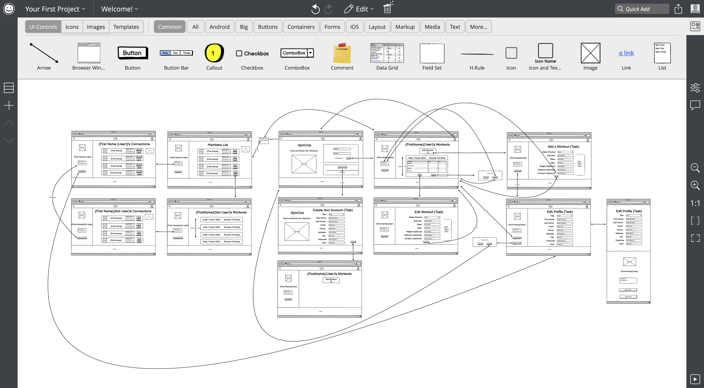
  
[Back to Contents](#Contents)  
  
## Technologies Used

### Languages

- [HTML](https://en.wikipedia.org/wiki/HTML) - 61.2%
- [CSS](https://en.wikipedia.org/wiki/CSS) - 9.7%
- [Javascript](https://en.wikipedia.org/wiki/JavaScript) 1.7%
- [Python] (https://www.python.org) 27.4
- [Jinja] (https://jinja.palletsprojects.com/en/3.1.x/)

### Frameworks and Tools

- [Git](https://git-scm.com/)
- [Github](https://github.com/)
- [Heroku](https://www.heroku.com)
- [Balsamiq](https://balsamiq.com/wireframes/)
- [Adobe Suite (Illustrator, Photoshop & InDesign)](https://www.adobe.com/uk/)
- [Font Awesome](https://fontawesome.com/search)
- [Google Fonts](https://fonts.google.com)
- [Materialise](https://materializecss.com)
- [Favicon](https://iconifier.net)  
- [W3 Schools](https://www.w3schools.com)
- [W3C validator](https://validator.w3.org/)
- [Jigsaw CSS validator](https://jigsaw.w3.org/css-validator/)
- [Text Editor](https://support.apple.com/en-gb/guide/textedit/welcome/mac)
- [Markdown Editor](https://iwaki.info/markdown-editor-mac/en/index.html)
- [Google Chrome](https://www.google.com/chrome/)
- [Apple Safari](https://www.apple.com/uk/safari/)
- [Apple Voice Over](https://support.apple.com/en-gb/guide/iphone/iph3e2e415f/ios)
- [ChatGPT](https://chat.openai.com)
- [JSLint](https://www.jslint.com)
- [Flask](https://flask.palletsprojects.com/en/3.0.x/)
- [SQL Alchemy](https://www.sqlalchemy.org)
- [VS Code](https://code.visualstudio.com)
- [ElephantSQL](https://www.elephantsql.com/)
- [Pillow]()

#### Requirements File

blinker==1.7.0
click==8.1.7
Flask==3.0.2
Flask-Login==0.6.3
Flask-Mail==0.9.1
Flask-Reuploaded==1.4.0
Flask-SQLAlchemy==3.1.1
Flask-Uploads==0.2.1
Flask-WTF==1.2.1
greenlet==3.0.3
gunicorn==21.2.0
itsdangerous==2.1.2
Mako==1.3.2
pillow==10.2.0
psycopg2-binary==2.9.9
SQLAlchemy==2.0.28
Werkzeug==3.0.1
WTForms==3.1.2

  
[Back to Contents](#Contents)  
  
## Features

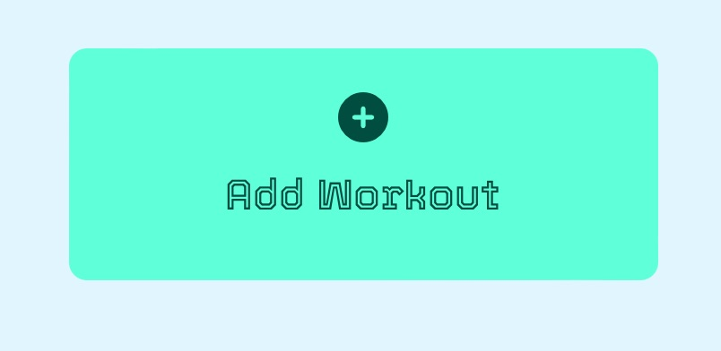

- Workout Logger
  - The main feature of the home page, the workout logger contains input fields to enable the user to record their workouts.
  - It is designed with knowledge of the typical organisation of workouts and their variables.
  - To assist the user in obtaining a clear picture of their workouts, certain inputs are compulsory, whereas others are optional depending on the type of workout undertaken.
  - Once the workout and initial exercise have been recorded, additional exercises can be added to the workout, providing a complete and detailed account of the users session.
  - If any details are entered incorrectly, the user is able to easily amend these at a later date.
  - The results of the feature are made available to other users to support the sharing of knowledge and offer motivation.
  - User stories covered: 

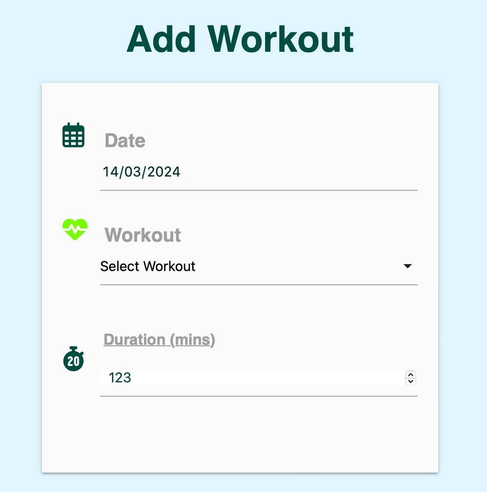  

- Add Workout
  - Uses javascript (getElementById, eventListeners, and if/else statments) to add user inputs to the database, provide select options, and define input values.
  - An alert is triggered if unacceptable information is entered. NB. EMAIL ADDRESSES ARE OT REQUIRED TO BE CORRECTLY FORMATED ON PURPOSE (ONLY 4 CHARACTERS MINUMUM). THIS IS FOR TESTING CONVENIENCE TO ALLOW THE OPENING OF MULTIPLE ACCOUNTS. PASSWORD ON ALL EXAMPLE ACCOUNTS: 1111111
  - User stories covered: 

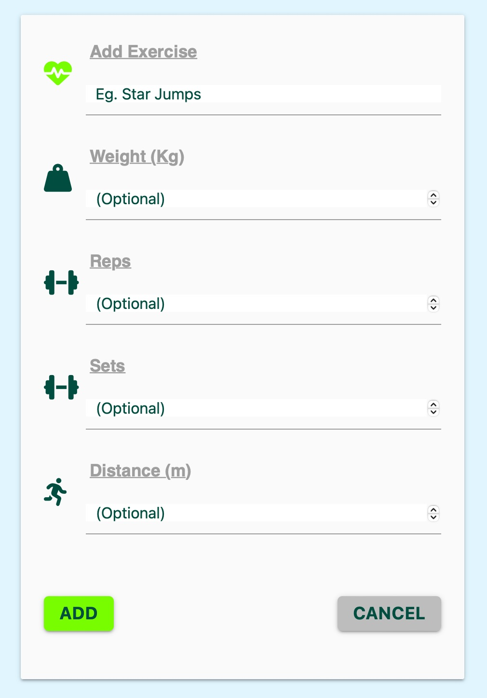  

- Add Exercise
  - Uses javascript (getElementById, eventListeners, and if/else statments) to add user inputs to the database, provide select options, and define input values.
  - An alert is triggered if unacceptable information is entered.
  - An additional alert is placed on the 'Bulk' button to advise the user that a resistance training routine s recommended with this option.
  - User stories covered: 

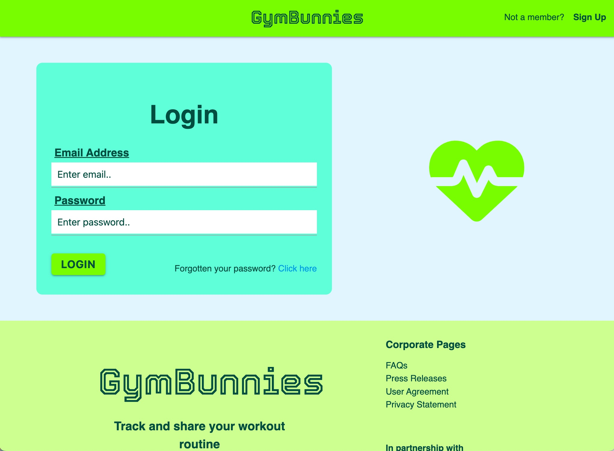  

- Login/sign_up Page
  - Uses Python to create a password-protected profile for each user.
    - Enables connections to be made between users to help build a community either online or in the gym
  - Alerts guide the user through the process
  NB. EMAIL ADDRESSES ARE NOT REQUIRED TO BE CORRECTLY FORMATED ON PURPOSE (ONLY 4 CHARACTERS MINUMUM). THIS IS FOR TESTING CONVENIENCE TO ALLOW THE OPENING OF MULTIPLE ACCOUNTS. PASSWORD ON ALL EXAMPLE ACCOUNTS: 1111111

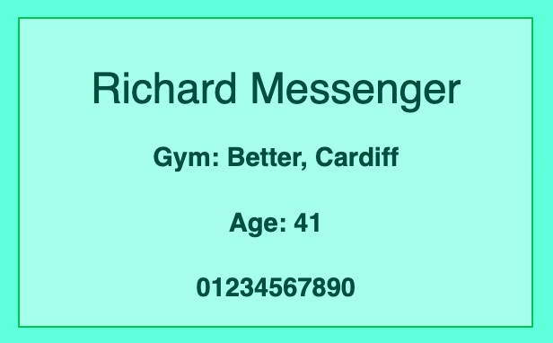  

- Personal Information Output
  - Uses Python and Jinja to display user inputs once information has been provided by the user through the above methods.
  - Information varies depending on connection status when viewed by visitors:
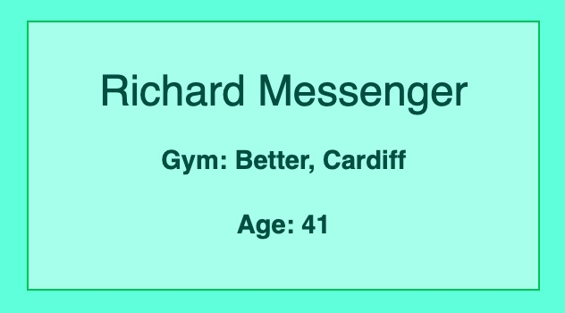
  - User stories covered: 

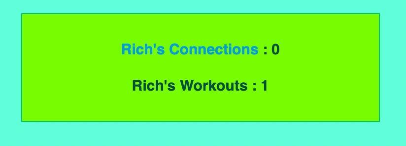  

- Site Activity Output
  - Uses Python and Jinja to display user inputs once information has been provided by the user through the above methods.
  - User stories covered: 

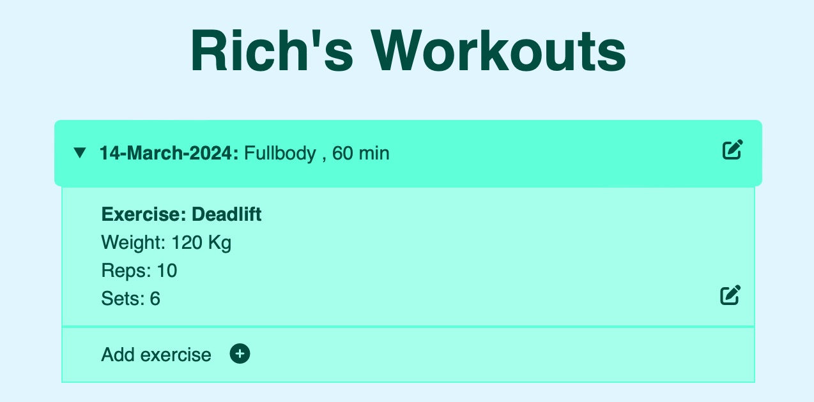  

- Activity Level Selection
  - Uses HTML to display user workouts.
  - Add and edit options are easily identifable and conveniently located.
  - A slight colour differential is used to separate workouts and exercises.
  - User stories covered: 

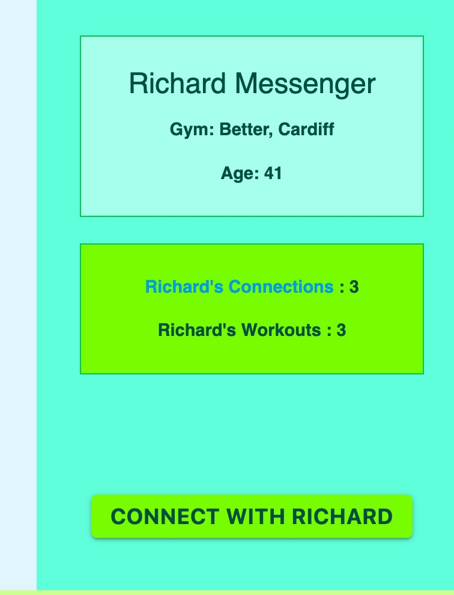  

- Add connection Button
  - Uses Python and Jinja to execute the required function. Once clicked, a 'request sent' notification is displayed until the request is acted upon. This prevents clashes on the database.
  - User stories covered: 

 

- Footer Section
  - The footer contains GymBunnies' logo and links to corporate pages and social media.
  - Social media pages open in a new window.
  - Pages are listed for easy navigation:
    - Corporate Information
  - Each page listed in the footer is sepatate from the main page.
  - The footer is the same on every page and is colour coordinated with the top navigation bar for a visual link.
  - Footer logo contains a link to help the user return to the home page.
  - Pages:
    - FAQ
    - Press Releases
    - User Agreement
    - Privacy Statement
  - User stories covered: 

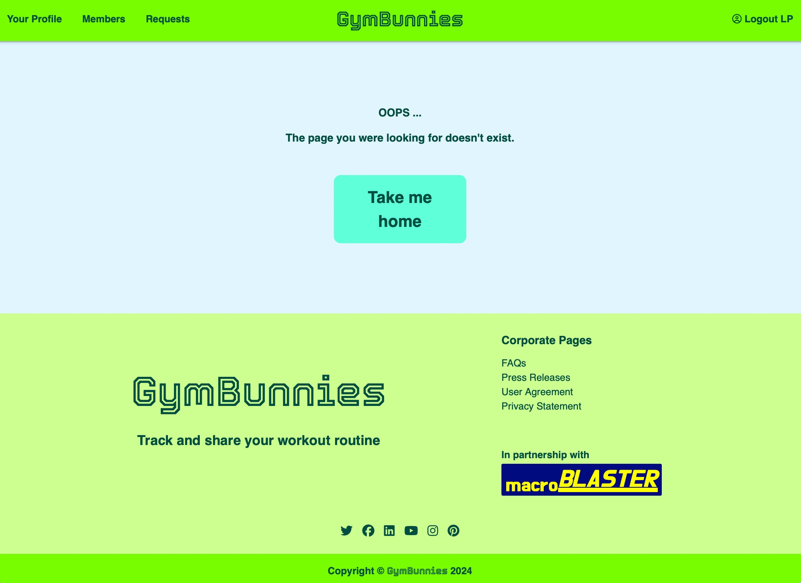 

- 404:
  - Contains a link to return the user to the home page if an incorrect address is entered.
  - User stories covered: 

### Future Features To Implement

- Profile Picture
- Macro calculation and input
- Graphical displays of progress
- Streamlined backend

  
[Back to Contents](#Contents)  
  
## Testing

All functions work as intended except the update password function, which requires further testing.

There are no dead or erroneous links.

To prevent users editing other users pages, Jinja is used to remove the offending links.

Two way checking on connections was implemented to prevent clashes.

When viewed on smaller screens, the sub-sections of the footer stack vertically instead of horizontally.

The website was navigated using Apple's Voice Over and aria labels were added to provide a coherent narrative to visually impaired users.

On deploying to GitHub, some alignment issues were noted when viewed on a phone for the first time and adjusted acordingly using Google Chrome's inspect feature. (See 'Bugs' below)

### HTML Validation

The templates were put through the W3C Markup Validation Service. Due to the use of a base.html template and Jinja, the errors returned were inconsistent with the actual code used, so their results have not been included.

Example for home.html:

home.html [results](https://validator.w3.org/nu/?doc=https%3A%2F%2Fgymbunnies-211fc7651ce9.herokuapp.com%2Flogin%3Fnext%3D%252F1)

home.html 

### CSS Validation

The W3C Jigsaw CSS Validation Service passed the internal stylesheet with no errors. Two errors were located on external stylesheets, which the site owner has no control over.

styles.css [results](https://jigsaw.w3.org/css-validator/validator?uri=https%3A%2F%2Fgymbunnies-211fc7651ce9.herokuapp.com%2F1&profile=css3svg&usermedium=all&warning=1&vextwarning=&lang=en)  

### Accessibility

Accessibility testing was difficult because when login required pages, such as home.html, were tested the tool reverts to the login page. In this instance, one error was returned, for an empty link relating to the side bar menu, which is a javascript function. The one contrast error was for a link not being correctly displayed due to the tools overlay on th epage. Based on the above colour ratios, the site is deemed to be okay.

index.htm [results](https://wave.webaim.org/report#/https://gymbunnies-211fc7651ce9.herokuapp.com/1)

### Performance

Running each page through Google Lighthouse again proved problamatic given only the login page could be tested. As this page has an identical structure to the logged in pages, it's results, which were deemed acceptable, were taken as representative of every page. The site owners are still working on SEO and, once updated, this will rival that of previous projects!

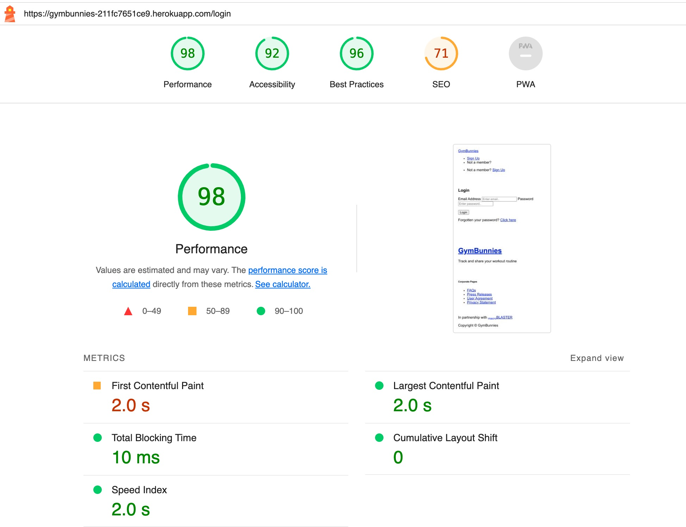

index.htm [results](https://googlechrome.github.io/lighthouse/viewer/?psiurl=https%3A%2F%2Fgymbunnies-211fc7651ce9.herokuapp.com%2Flogin&strategy=mobile&category=performance&category=accessibility&category=best-practices&category=seo&category=pwa&utm_source=lh-chrome-ext)

### Device testing

The website was tested on the following devices:
- MacBook Air
- iPad Mini
- iPhone XR
- iPhone 7
- iPhone 15 Pro
- iPhone 12

The website was tested using Google Chrome Developer Tools for a selection of popular devices across several manufacturers.

### Browser compatibility

The website was tested on the following browsers:
- Apple Safari
- Google Chrome

  
## Bugs & Development Issues

A number of bugs were encountered during the development of the application. Details are as follows:

A reoccuring problem was finding information not being displayed correctly through the use of Jinja. This was eventually found to be due to the required variables not being assigned to the corresponding route. 

A particularly trick occurence was on the all_users.html template, which required the inclusion of '[user.id]' after the variables total_workout and total_user_connections due to that page sharing information relating to unconnected users.

A number of attempts were made to include a profile picture feature. Pictures were made to upload to a directory within the static directory, but the function used to display them wasn't sufficient for the site owners requirements in that the picture needed to be re-uploaded on each visit. Another method was attempted involving the encryption of the file names but this completely failed to display the image on the profile page. More development is required for this feature to be effective.

When the edit workout button was initiallty placed on the article's summary tag, the link wouldn't trigger until after the article's details were opened. Moving the modal inside the summary resolved this issue.

The use of the date variable in the database schema proved problematic both for the user's date of birth and the workout date. Once the date formats were aligned, these issues were resolved.

A similar problems were found when choosing the type of number to assign to the database schema. It was decided that strings would be the best option to prevent errors occuring due to user preference. For example, the user entering ten minutes as either 10.00 or 10:00 or 10.0 or 10 or ten.

The initial database model featured the workouts and exercises together. Once it was found that this would place limitations on the site's flexibility, workouts and exersises were assigned as their own separate databases.

Workout date was originally set with the .now function but on testing, it was found that a user might forget to include a previous days workout and therefore wouldnot be able to include it as appropriate, again, limiting the sites functionality.

Upon attempting to edit an exercise and then cancelling the action, the exercise would duplicate. As a resolution, instead of using a form to carry out the cancel function,a link to the home page was used instead. This reolved the issue.

On the add workout route, dictionaries were used to define workouts and exercises. These were copied over to the edit workout and edit exercises routes but dictionaries were not appropriate here and the offending commas prevented the pages from loading.

Initially, connection requests were unrelated to their direction of travel. This caused conflicts between requests being accepted and denied. To resolve this connection requests were split into sender requests and receiver request.

There were issues using the id attribute on elements within Jinja loops because the element would in-effect be duplicated and you can only have one specific id per page. To resolve this, class attributes were used instead.

The delete user function failed to work on deployment. This was due to the cascade attribute not being applied to the additional connection databases. Once this was applied, the issue was resolved.

The delete user function worked prior to deployment and resulted in a different issue. If a user deleted their account whilst outstanding connection request remained unresponded to by other users, pages would fail to load when they eventually responded to them. To resolve this nullable=true was tried to allow zero records, becaus ethe accept response would be assigned zero because there was no user to receive it. This didn't work. To resolve this, a Jinja loop was used to prevent any requests where the sender record was zero from being displayed. If the site owners had more time, they would have looked at preventing this issue on the back end instead of putting a patch over the problem on tehm front end.
  
[Back to Contents](#Contents)  
  
## Deployment

The site was built using VS Code and a web browser before being deployed to GitHub pages, where the configuration variables were assigned. An env.py file was not used because all secure information was set to the os.environ (Heroku). 

Initial attempts were thwarted by the Procfile not being in the route directory and a lack of alignment between the config var keys.

The steps to deploy were as follows:
  - Create project in GitHub.
  - Set configuration variables
  - Get the DB_URL from ElephantSQL
  - Ensure all requirement.txt applications are installed
  - Install gunicorn and set it in the Procfile
  - Deploy the pages to Heroku through Github
  - Open the Heroku console and import the app and database from the app file

The live Heroku link can be found here: <https://gymbunnies-211fc7651ce9.herokuapp.com/login>

## Credits

A number of sources were used for the content and media on Gymbunnies's website.

- MaterializeCSS for their class functions and javascript <https://www.materialzecss.com>

Without the assistance of Open AI's Chat GPT facility, this project would not have been possible in the given timeframes

### Content

- Footer columns and responsive behaviour courtesy of: <https://www.w3schools.com>

### Media

- Logo font courtesy of : <https://fonts.google.com>
- Share and social media icons provided by: <https://www.fontawesome.com>

## Acknowledgements

**Written by** ***Richard Messenger***  
  
[Back to Contents](#Contents)  
